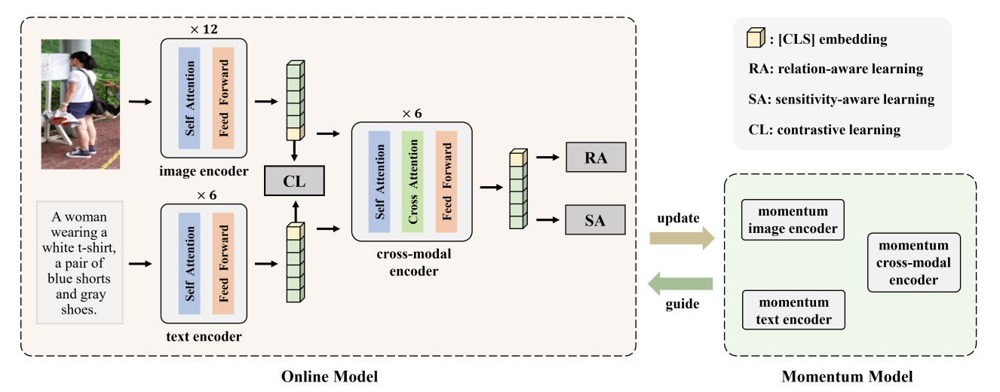

# RaSa: Relation and Sensitivity Aware Representation Learning for Text-based Person Search
[](https://github.com/Flame-Chasers/RaSa/blob/main/LICENSE)

This is the official PyTorch implementation of the paper [RaSa: Relation and Sensitivity Aware Representation Learning for Text-based Person Search (IJCAI 2023)](https://arxiv.org/abs/2305.13653). 
This repository supports training and evaluation on three text-based person search benchmarks: CUHK-PEDES, ICFG-PEDES and RSTPReid.



## Usage
### Requirements
- pytorch 1.9.1
- torchvision 0.10.1
- transformers 4.8.1
- timm 0.4.9

### Prepare Datasets
1. Download the CUHK-PEDES dataset from [here](https://github.com/ShuangLI59/Person-Search-with-Natural-Language-Description), ICFG-PEDES dataset from [here](https://github.com/zifyloo/SSAN) and RSTPReid dataset form [here](https://github.com/NjtechCVLab/RSTPReid-Dataset)
2. Organize them in `your dataset root dir` folder as follows:
    ```
    |-- your dataset root dir/
    |   |-- <CUHK-PEDES>/
    |       |-- imgs
    |           |-- cam_a
    |           |-- cam_b
    |           |-- ...
    |       |-- reid_raw.json
    |
    |   |-- <ICFG-PEDES>/
    |       |-- imgs
    |           |-- test
    |           |-- train
    |       |-- ICFG-PEDES.json
    |
    |   |-- <RSTPReid>/
    |       |-- imgs
    |       |-- data_captions.json
    ```
3. Split the raw annotations into train.json, val.json and test.json for training, validation and testing.
    ```shell
    # 1. CUHK-PEDES
    bash shell/data_process.sh
    # or
    python data_process.py --dataset_name "CUHK-PEDES" --dataset_root_dir [CUHK-PEDES DATASET DIRECTORY]
    
    # 2. ICFG-PEDES
    bash shell/data_process.sh
    # or
    python data_process.py --dataset_name "ICFG-PEDES" --dataset_root_dir [ICFG-PEDES DATASET DIRECTORY]

    # 3. RSTPReid
    bash shell/data_process.sh
    # or
    python data_process.py --dataset_name "RSTPReid" --dataset_root_dir [RSTPReid DATASET DIRECTORY]
    ```
4. Organize the datasets as follows:
   ```
    |-- your dataset root dir/
    |   |-- <CUHK-PEDES>/
    |       |-- imgs
    |           |-- cam_a
    |           |-- cam_b
    |           |-- ...
    |       |-- processed_data
    |           |-- train.json
    |           |-- val.json
    |           |-- test.json
    |       |-- reid_raw.json
    |
    |   |-- <ICFG-PEDES>/
    |       |-- imgs
    |           |-- test
    |           |-- train
    |       |-- processed_data
    |           |-- train.json
    |           |-- val.json
    |           |-- test.json
    |       |-- ICFG-PEDES.json
    |
    |   |-- <RSTPReid>/
    |       |-- imgs
    |       |-- processed_data
    |           |-- train.json
    |           |-- val.json
    |           |-- test.json
    |       |-- data_captions.json
    ```

### Pretrained Checkpoint
- Please download the [pretrained ALBEF Checkpoint](https://storage.googleapis.com/sfr-pcl-data-research/ALBEF/ALBEF.pth).

### Training
```shell
# Usage:
# 1. Training on CUHK-PEDES
bash shell/cuhk-train.sh
# or
python -m torch.distributed.run --nproc_per_node=4 --rdzv_endpoint=127.0.0.1:29501 \
Retrieval.py \
--config configs/PS_cuhk_pedes.yaml \
--output_dir output/cuhk-pedes/train \
--checkpoint [PRETRAINED ALBEF CHECKPOINT PATH] \
--eval_mAP

# 2. Training on ICFG-PEDES
bash shell/icfg-train.sh
# or
python -m torch.distributed.run --nproc_per_node=4 --rdzv_endpoint=127.0.0.1:29501 \
Retrieval.py \
--config configs/PS_icfg_pedes.yaml \
--output_dir output/icfg-pedes/train \
--checkpoint [PRETRAINED ALBEF CHECKPOINT PATH] \
--eval_mAP

# 3. Training on RSTPReid
bash shell/rstp-train.sh
# or
python -m torch.distributed.run --nproc_per_node=4 --rdzv_endpoint=127.0.0.1:29501 \
Retrieval.py \
--config configs/PS_rstp_reid.yaml \
--output_dir output/rstp-reid/train \
--checkpoint [PRETRAINED ALBEF CHECKPOINT FILE PATH] \
--eval_mAP
```

### Testing
```shell
# Usage:
# 1. Testing on CUHK-PEDES
bash shell/cuhk-eval.sh
# or
python -m torch.distributed.launch --nproc_per_node=4 --rdzv_endpoint=127.0.0.1:29501 \
Retrieval.py \
--config configs/PS_cuhk_pedes.yaml \
--output_dir output/cuhk-pedes/evaluation \
--checkpoint [CHECKPOINT FILE PATH] \
--eval_mAP \
--evaluate

# 2. Testing on ICFG-PEDES
bash shell/icfg-eval.sh
# or
python -m torch.distributed.launch --nproc_per_node=4 --rdzv_endpoint=127.0.0.1:29501 \
Retrieval.py \
--config configs/PS_icfg_pedes.yaml \
--output_dir output/icfg-pedes/evaluation \
--checkpoint [CHECKPOINT FILE PATH] \
--eval_mAP \
--evaluate

# 3. Testing on RSTPReid
bash shell/rstp-eval.sh
# or
python -m torch.distributed.run --nproc_per_node=4 --rdzv_endpoint=127.0.0.1:29501 \
Retrieval.py \
--config configs/PS_rstp_reid.yaml \
--output_dir output/rstp-reid/evaluation/ \
--checkpoint [CHECKPOINT FILE PATH] \
--eval_mAP \
--evaluate
```

## RaSa Performance on Three Text-based Person Search Benchmarks
### CUHK-PEDES dataset

|     Method      |  Rank-1   |  Rank-5   |  Rank-10  |    mAP    |
|:---------------:|:---------:|:---------:|:---------:|:---------:|
|     CMPM/C      |   49.37   |   71.69   |   79.27   |     -     |
|      ViTAA      |   55.97   |   75.84   |   83.52   |     -     |
|      DSSL       |   59.98   |   80.41   |   87.56   |     -     |
|       SAF       |   64.13   |   82.62   |   88.40   |   58.61   |
|      LGUR       |   65.25   |   83.12   |   89.00   |     -     |
|       IVT       |   65.59   |   83.11   |   89.21   |     -     |
|      CFine      |   69.57   |   85.93   |   91.15   |     -     | 
|    **ALBEF**    |   60.28   |   79.52   |   86.34   |   56.67   |
| **RaSa (ours)** | **76.51** | **90.29** | **94.25** | **69.38** |

[Model for CUHK-PEDES](https://drive.google.com/file/d/1BC1L-5JuIXHt6NR_l2ENHG3NZhncU91s/view?usp=sharing)

### ICFG-PEDES dataset

|     Method      |  Rank-1   |  Rank-5   |  Rank-10  |    mAP    |
|:---------------:| :-------: | :-------: | :-------: | :-------: |
|     CMPM/C      |   43.51   |   65.44   |   74.26   |     -     |
|      SSAN       |   54.23   |   72.63   |   79.53   |     -     |
|       SAF       |   54.86   |   72.13   |   79.13   |   32.76   |
|       IVT       |   56.04   |   73.60   |   80.22   |     -     |
|      CFine      |   60.83   |   76.55   |   82.42   |     -     |
|    **ALBEF**    |   34.46   |   52.32   |   60.40   |   19.62   |
| **RaSa (ours)** | **65.28** | **80.40** | **85.12** | **41.29** |

[Model for ICFG-PEDES](https://drive.google.com/file/d/1lLB332ANq87v2jV2bLdsV7rQ7OBAnP9X/view?usp=sharing)

### RSTPReid dataset

|     Method      |  Rank-1   |  Rank-5   |  Rank-10  |    mAP    |
|:---------------:| :-------: | :-------: | :-------: | :-------: |
|      DSSL       |   32.43   |   55.08   |   63.19   |     -     |
|      SSAN       |   43.50   |   67.80   |   77.15   |     -     |
|       SAF       |   44.05   |   67.30   |   76.25   |   36.81   |
|       IVT       |   46.70   |   70.00   |   78.80   |     -     |
|      CFine      |   50.55   |   72.50   |   81.60   |     -     |
|    **ALBEF**    |   50.10   |   73.70   |   82.10   |   41.73   |
| **RaSa (ours)** | **66.90** | **86.50** | **91.35** | **52.31** |

[Model for RSTPReid](https://drive.google.com/file/d/1e5KPmfoij22J2zZOZxhSodU4SNz76BjX/view?usp=sharing)


## Acknowledgments
The implementation of RaSa relies on resources from [ALBEF](https://github.com/salesforce/ALBEF), [Huggingface Transformers](https://github.com/huggingface/transformers), and [timm](https://github.com/rwightman/pytorch-image-models/tree/master/timm). We sincerely appreciate the original authors for their open-sourcing.


## Citation
If you find this code useful for your research, please cite our paper.

```tex
@article{bai2023rasa,
  title={RaSa: Relation and Sensitivity Aware Representation Learning for Text-based Person Search},
  author={Bai, Yang and Cao, Min and Gao, Daming and Cao, Ziqiang and Chen, Chen and Fan, Zhenfeng and Nie, Liqiang and Zhang, Min},
  journal={arXiv preprint arXiv:2305.13653},
  year={2023}
}
```
